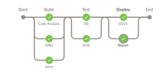
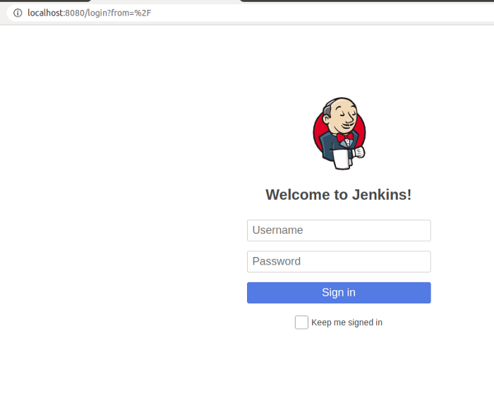
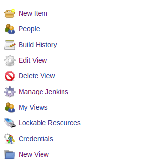
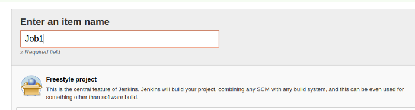
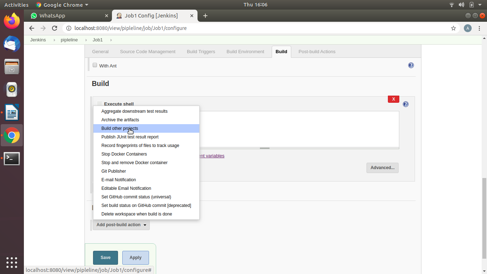

# Jenkins_CICD
 
## Tools to build a very basic and exciting pipleine using Docker and Jenkins
**What is Docker**
- Docker takes away repetitive, mundane configuration tasks and is used throughout the development lifecycle for fast, easy and portable application development - desktop and cloud. Docker’s comprehensive end to end platform includes UIs, CLIs, APIs and security that are engineered to work together across the entire application delivery lifecycle.
- Its one of the best vertualization platform to containerise your app.
- A huge benefit of this is the ability seperate non-dependent steps and run them in parallel, running application in containers instead of virtual machines.
- Make it easier to create, deploy and run application by using containers.

**Continuce Integration CI and Continuce Delivery and Deployment CD**

- It's a backbone of DevOps practices and automation.
- Jenkins offers a simple way to set up a continuous integration or continuous delivery (CI/CD) environment for almost any combination of languages and source code repositories using pipelines, as well as automating other routine development tasks.
- 

  

**Pipeline**
Pipelines are Jenkins jobs enabled by the Pipeline (formerly called “workflow”) plugin and built with simple text scripts that use a Pipeline DSL (domain-specific language) based on the Groovy programming language.

Pipelines leverage the power of multiple steps to execute both simple and complex tasks according to parameters that you establish. Once created, pipelines can build code and orchestrate the work required to drive applications from commit to delivery.

## Jenkins pipeline step by step
- **Step 1** — How to create a Jenkins job —
- **Step 2** — How to build a pipeline in Jenkins
- **Step 3** — How to link the jobs

**Prerequisites: Jenkins and Docker should be installed on your system**

**Jenkins:** https://jenkins.io/doc/book/installing/

**Docker:** https://docs.docker.com/search/?q=install

**Step 1: Start Jenkins**
Run this command from the folder where you have jenkins.war file
Command to start Jenkins: java -jar jenkins.war
Open your browser and type www.localhost:8080
If port 8080 is already in use then use java -jar jenkins.war –-httpPort=7070
(you can specify any other port number).
Login to your account:

**Click on New Item**

**Enter name as Job1 (you can choose any name you wish)**

select **freestyle project** then click OK
**Repeat these steps to create to 2 more jobs with names Job2 and Job3**

click on **dashboard**
Your dashboard should look like this

Now click on **Job1**
Click on **Configure** on the left menu

click on **add build step**

Select **Execute shell**

Enter this command: **date**

Then click on **Post-build Actions** and select **build other projects**

Enter name of **Job2** then click *apply* and *save*.
Click on **back to dashboard** and **repeat same steps as Job1**:
click on **Job2** then click on **configure**
click on **add build step** and select **Execute shell**
Enter this command: **sudo docker pull yourname/jenkins:v1**

Enter **Job3** in **Project to build** field, **apply** and **save**.
Click on **Back to dashboard**
click on **Job3** then click on **Configure**
click on **Add build step** and select **Execute shell**

Enter this command: **sudo docker pull yourname/Enter this command: sudo docker pull**

Click **apply** and **save**.
**We have built our pipeline using Jenkins!!! Its show time now!**
**Back to dashboard** and click on **Job1**

Click on **Build Now** on the left menu above
It will build the Job1 simply by printing today’s date and trigger the next Job — Job2
To see the outcome of Job1 click on **console output**

Job1 has been successfully completed and it automatically triggered Job2
Click on Job2 on the above screen on your system then click on down arrow underneath **build history** and select **Console output**

Job2 output will pull the image from Docker hub repository as below

Job2 has successfully pulled Docker image from Docker hub repository!
Click on Job3 on the above screen on your system and repeat same steps as Job2 to view Console output for Job3
Job3 will run the image pulled by Job2 and display the message from Docker image as below

* https://medium.com/@ahshahkhan/devops-culture-and-cicd-3761cfc62450